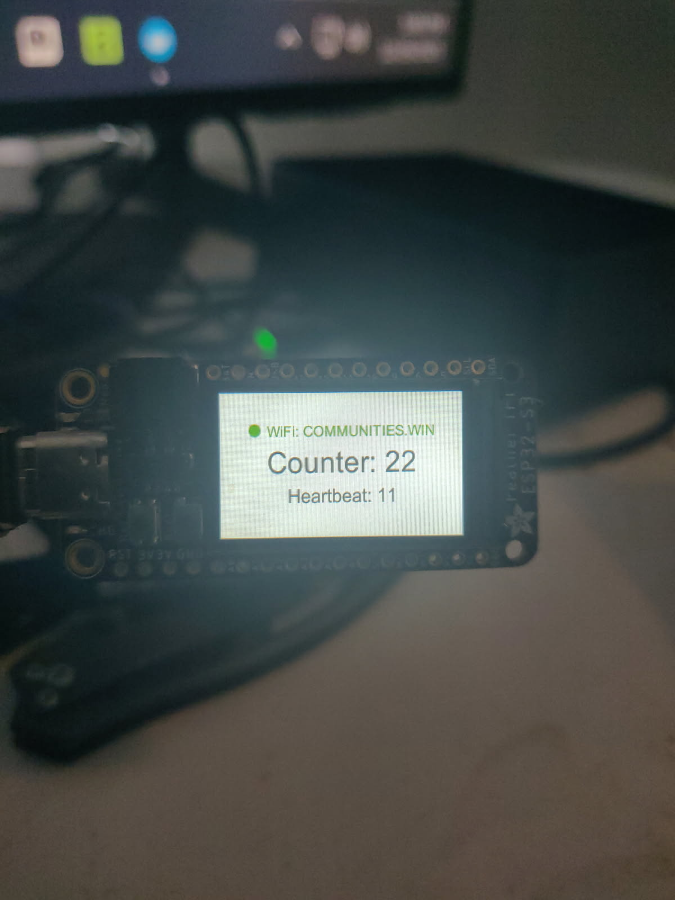

# speed-rs-ctl

ESP32-S3 firmware project using Embassy + Rust.

## Demo



## MOST COMMON COMMANDS QUICK REFERENCE 
```powershell
cargo esp-build-all-release
```
```powershell
espflash flash --port COM3 -M target\xtensa-esp32s3-none-elf\release\slint_tft
```

```
cargo run --bin web_gui --features web_gui
```
```
cargo build --release --bin web_gui --features web_gui
```


## Prerequisites

- Rust toolchain (installed via `rustup`)
- Windows PowerShell (examples below use PowerShell)
- A connected ESP32-S3 board (e.g. Adafruit ESP32-S3 TFT Feather)

## Install Build Essentials (Part of RustUp Installation)
```winget install --id Microsoft.VisualStudio.2022.BuildTools --override "--passive --add Microsoft.VisualStudio.Workload.VCTools --includeRecommended"```

## Install tools

Install the ESP Rust toolchain helper and set up the `esp` toolchain:

```powershell
cargo install espup
espup install
```

Install useful helpers:

```powershell
cargo install esp-generate
cargo install espflash
```

Optional: install `esp-config` (TUI):

```powershell
cargo install esp-config --features=tui --locked
```

Optional: Probe-rs tools installer script (PowerShell):

```powershell
irm https://github.com/probe-rs/probe-rs/releases/latest/download/probe-rs-tools-installer.ps1 | iex
```

Optional: create a new project (example):

```powershell
esp-generate --chip=esp32s3 speed-rs-ctl
```

## Build

This repo defines Cargo aliases in `.cargo/config.toml`.

Build all ESP32-S3 binaries (release):

```powershell
cargo esp-build-all-release
```

Build just the Slint TFT app (release):

```powershell
cargo esp-build-slint-tft-release
```

## RUN DESKTOP GUI
```powershell
# The desktop GUI hosts an embedded MQTT broker on TCP :1883 (standard MQTT port)
# and uses UDP broadcast discovery on :53530
# to find the ESP automatically (no hardcoded IP).
cargo run --bin web_gui --features web_gui

# If your router/VLAN blocks 255.255.255.255 broadcasts, set the subnet broadcast explicitly:
# $env:SPEED_DISCOVERY_BROADCAST = "192.168.0.255"

# Optional override (skip discovery):
# $env:SPEED_ESP_HOST = "192.168.0.50"

# If UDP discovery is blocked (VLANs, Wi-Fi isolation, Windows firewall), set SPEED_ESP_HOST
# so web_gui will also send discovery announces directly (unicast) to that IP.

# Note: setting SPEED_ESP_HOST enables unicast discovery announces
# (helpful when broadcasts are blocked across VLANs/subnets).
```

## Flash

You can flash a built binary using `espflash`.

If you don’t specify `--port`, `espflash` will try to auto-detect. On Windows, it’s often easiest to specify it explicitly (e.g. `COM3`).

Flash the Slint TFT firmware:

```powershell
espflash flash --port COM3 -M target\xtensa-esp32s3-none-elf\release\slint_tft
```

Flash the main firmware (`speed`):

```powershell
espflash flash --port COM3 -M target\xtensa-esp32s3-none-elf\release\speed
```

Flash the TFT test binary (`tft`):

```powershell
espflash flash --port COM3 -M target\xtensa-esp32s3-none-elf\release\tft
```

## Troubleshooting

- **No serial ports detected**: try a different USB cable (data-capable), different USB port, and confirm the board enumerates in Device Manager.
- **Wrong COM port**: use the COM port shown by `espflash` or Device Manager.
- **Rebuild issues**: run the matching `cargo esp-build-*` alias again (these include the required `-Z build-std=core,alloc` flags).